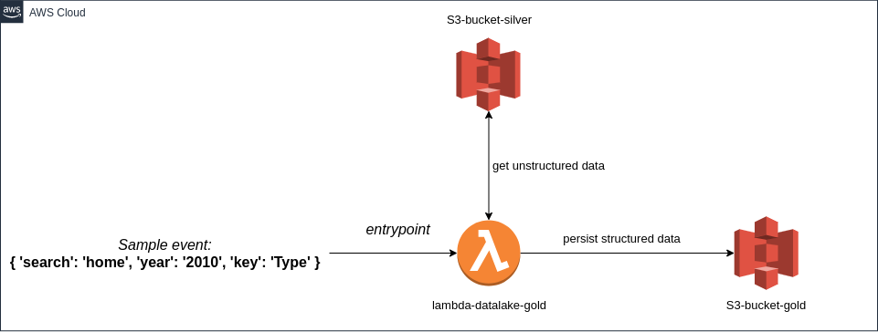

# Gold Layer Datalake Persistence Lambda

> The purpose of this project is to prepare a study environment.

This project gives you an **AWS Lambda** function in manual execution mode to get unstructured data from AWS S3 Silver Layer bucket, apply tranformations
and persist the structured data on AWS S3 Gold Layer bucket.
Additionally, the project uses the [serverless-python-requirements](https://github.com/UnitedIncome/serverless-python-requirements) for the [Serverless Framework](https://www.serverless.com/), with the purpose of dealing with Python packaging on AWS Lambda.

This project is the last step of the ingestion pipeline study. The first one is [Silver Layer Datalake Persistence Lambda](https://github.com/fillipevieira/lambda-datalake-silver)  

## Tech Stack
- Infra

| Component                      | Version              |
| --------------------           | -------------------- |
| AWS Lambda                     |           -          |
| AWS S3                         |           -          |
| serverless-python-requirements | 5.1.0                |

- Languages

| Python |
| ------ |
| 3.7.9  |
